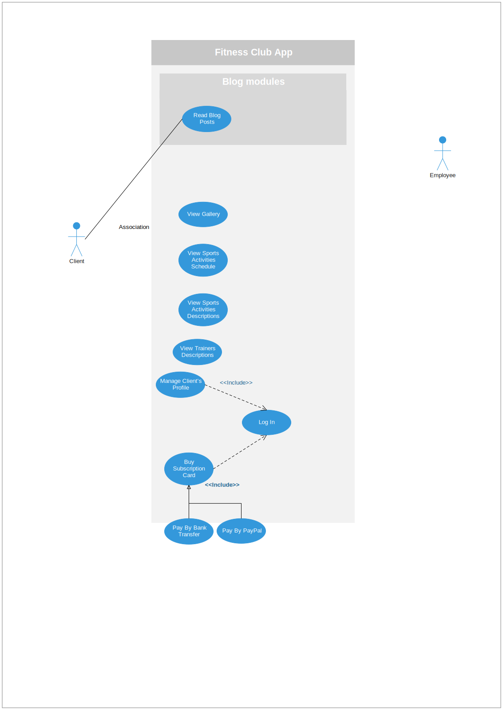
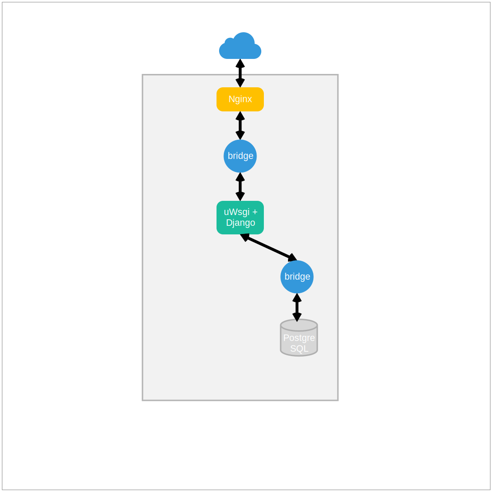

# Fitness Club
**Caution!** This code was created to be a attachment for a job application. It is not suitable for commercial purposes. If you find something interesting in it, please do not hesitate to reuse.

#### Table of Contents

1. Application stack overview
2. Introduction
3. Simplified use cases diagram
4. Application’s architecture and programming environment  
    4.1 Virtual enviroment  
    4.2 Servers  
    4.3 App Backend  
    4.4 App Frontend  
    4.5 Tools  
5. Description of functionalities and programming notes
6. Detailed list of used technologies

### 1. Application stack overview

    
        
    
       
        
    
        
    
         
    
    
         
        
    
    

### 2. Introduction
**"Fitness Club"** is a web application which  in a complex way supports running a modern fitness center. It provides many tools both in terms of improving customer service and marketing activities.

### 3. Simplified use cases diagram

### 4. Application’s architecture and programming environment

#### 4.1 Virtual enviroment

#### 4.2 Servers

#### 4.3 App Backend

#### 4.4 App Frontend

#### 4.5 Tools

### 5. Description of functionalities and programming notes

### 6. Detailed list of used technologies