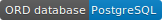
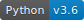
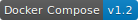

# Fitness Club
**Caution!** This code was created to be a attachment for a job application. It is not suitable for commercial purposes. If you find something interesting in it, please do not hesitate to reuse.

#### Table of Contents

1. Application stack overview
2. Introduction
3. Simplified use cases diagram
4. Application’s architecture and programming environment  
    4.1 Virtual enviroment  
    4.2 Servers  
    4.3 App Backend  
    4.4 App Frontend  
    4.5 Tools  
5. Description of functionalities and programming notes
6. Detailed list of used technologies

### 1. Application stack overview

      

    
         
    
        
         
    
         
    
          
         
         
    
    

### 2. Introduction
**"Fitness Club"** is a web application which allows customers to get to know fitness center's offer and events. It provides many tools both in terms of improving customer service and marketing activities.

#### 3. Programming environment and tools

    Docker and Docker Compose are used to perform the virtualization of the runtime environment.

    Http requests for static files are supported directly by Nginx. Site content created dynamically is 
    delivered using uWsgi.

    Support of subdomains traffic is supported by Django Hosts (Django library).

    Application's main data are saved in PostgreSQL database. Data used to search through blog posts are 
    saved in noSql format. Other information which can not be gruped are formatted and pleaced in *.txt files.

    Application's backend is based on Python web framework - Django and oter libraries connected to it. 
    
    All JS and CSS/SCSS files are bundled using the Webpack. Every site contains only one *.js and *.css files.

### 4. Description of functionalities

    Application features grouped by modules.

    Blog
        - reading posts
        - recommending reading posts through email message
        - commenting posts
        - searching posts by tag
        - searching similar posts
        - searching posts by keywords
        - using RSS web feed

    Blog_backend
        - creating, editing and removing posts
        - photo processing
        - assigning tags and SEO friendly urls
        - providing sitemap

    Employees
        - viewing employees pictures
        - reading employees descriptions

    Employees_backend
        - creating and removing employees accounts
        - editing employees data

    Footer_backend
        - editing footer data

    Slider_backend
        - creating and removing main site slides
        - changing slides order

    Account
        - authenticating employees

### 5. Detailed list of used technologies

| Serwers      | Nginx, Uwsgi |
| Databases      | PostgreSQL, Redis      |
| Search engine | Apache Solr      |
| Python | Pip,  Django, Django REST, Crispy Forms, Taggit, Sitemap, Feed, Haystack, Pillow, Django Hosts, Serializers, sorl-thumbnail, Django-Betterforms      |
| Search engine | Apache Solr      |
| Search engine | Apache Solr      |
| Search engine | Apache Solr      |
| Search engine | Apache Solr      |
| Search engine | Apache Solr      |

Nginx, Uwsgi
PostgreSQL, Redis
Apache Solr
Python, Pip,  Django, Django REST, Crispy Forms, Taggit, Sitemap, Feed, Haystack, Pillow, Django Hosts, Serializers, sorl-thumbnail, Django-Betterforms
Html5, Css3, Sass, Bootstrap
JavaScript, Vue, Vuex, Data Tables, DateTime Picker, CropperJs, jQuery-ui, Waypoints, Parallax, CountUp
Node js, Npm, Webpack (Css and Js optimizers, svg to woff converter)
Docker, Docker-Compose
Mailhog
